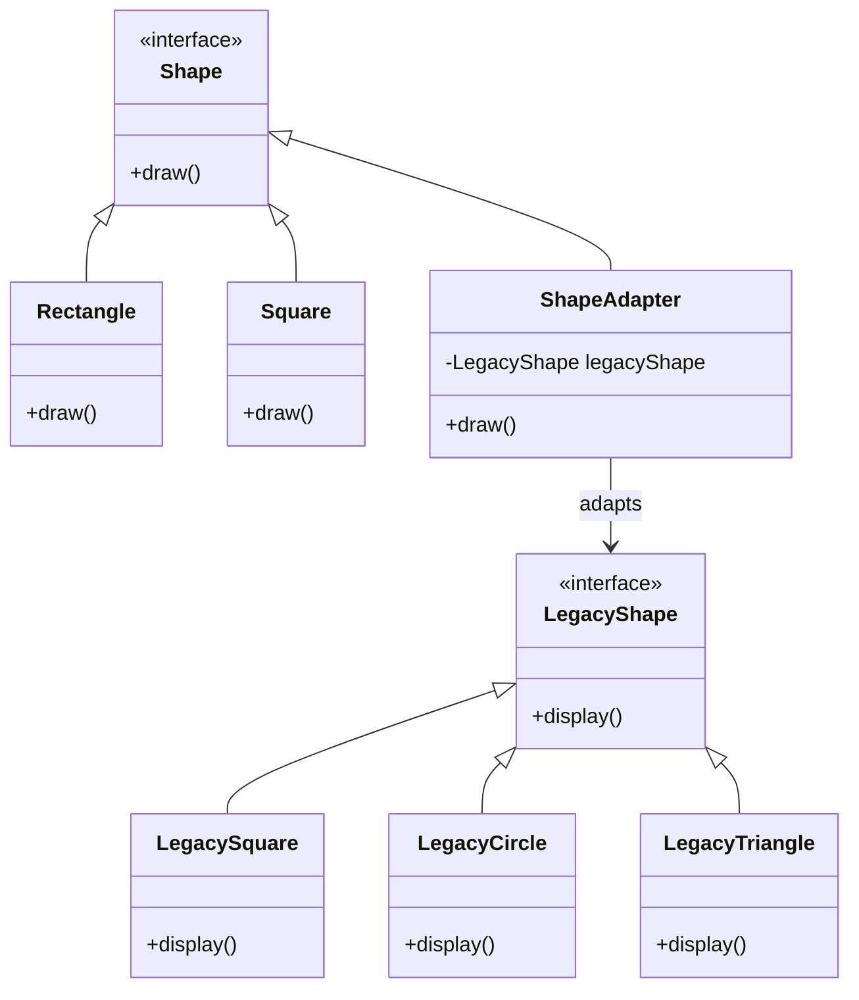
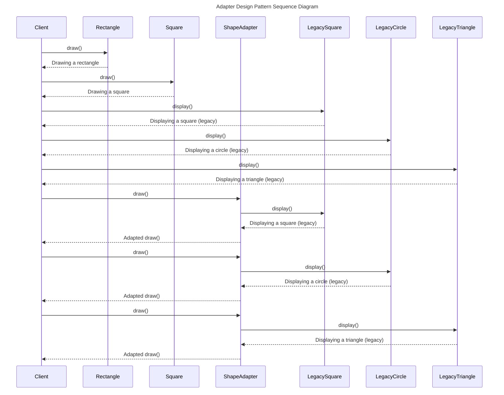

# Adapter Pattern in Kotlin

## Intent

The intent of the Adapter pattern is to convert the interface of a class into another interface that clients expect. This allows incompatible classes to work together seamlessly.

### Implementation

In this example, we have two sets of classes: `Shape` and `LegacyShape`. The `Shape` classes represent the new system, while the `LegacyShape` classes represent the legacy system. We want to use the `Shape` classes in our system, but they have a different interface than the `LegacyShape` classes.

## Pros
- **Reusability**: Allows reusing existing code with incompatible interfaces.
- **Flexibility**: Can work with different implementations without changing the client code.
- **Single Responsibility Principle**: Separates interface adaptation from the core functionality.

## Cons
- **Complexity**: Adds extra classes, which can make the code more complex.
- **Overhead**: Might add a slight performance overhead due to additional layers of abstraction.

## Conclusion
The Adapter design pattern is beneficial when you need to integrate classes with incompatible interfaces into an existing system. It promotes code reusability and flexibility but can introduce additional complexity and slight performance overhead. It's particularly useful in legacy system integration or when dealing with third-party libraries.

## Class Diagram

### In this Diagram:

The class diagram represents the structure of a system that uses the Adapter design pattern. It consists of several classes and interfaces:

- `Shape`: This is an interface that represents the new system's shapes. It has a `draw()` method that all shapes in the new system must implement.

- `Rectangle` and `Square`: These are concrete classes that implement the `Shape` interface. They represent specific shapes in the new system.

- `LegacyShape`: This is an interface that represents the legacy system's shapes. It has a `display()` method that all shapes in the legacy system must implement.

- `LegacySquare`, `LegacyCircle`, and `LegacyTriangle`: These are concrete classes that implement the `LegacyShape` interface. They represent specific shapes in the legacy system.

- `ShapeAdapter`: This is a class that implements the `Shape` interface and has a reference to a `LegacyShape`. It adapts the `LegacyShape` to the `Shape` interface by calling the `display()` method of the `LegacyShape` in its `draw()` method.

The arrows in the diagram represent inheritance (the arrow points to the parent class or interface) and association (the arrow points to the associated class). The `ShapeAdapter` class has an association with the `LegacyShape` interface, meaning it has a reference to a `LegacyShape` object.

## Sequence Diagram

### In this Diagram:

The sequence diagram illustrates the interaction between the client, various shapes, and the adapter in the Adapter design pattern.

* `Client` calls draw on `Rectangle` and `Square`: The Client initiates a draw method call on instances of Rectangle and Square, which are part of the Shape interface. These classes handle their own drawing functionality and return the result to the client.

* `Client` calls display on Legacy Shapes: The Client directly calls the display method on instances of LegacySquare, LegacyCircle, and LegacyTriangle, which belong to the LegacyShape interface. These legacy shapes handle their own display functionality.

* `Client` uses `ShapeAdapter` to adapt Legacy Shapes: The Client then uses ShapeAdapter to adapt legacy shapes to the new Shape interface. When the draw method is called on ShapeAdapter, it internally calls the display method on the associated LegacyShape instance. The ShapeAdapter thus enables the legacy shapes to be used wherever the Shape interface is expected.

**Sequence of Adaptation**:

* `Client -> ShapeAdapter (draw)`: The client calls the draw method on an instance of ShapeAdapter.
* `ShapeAdapter -> LegacySquare (display)`: The ShapeAdapter calls the display method on the LegacySquare instance, adapting it to fit the Shape interface.
* `LegacySquare -> ShapeAdapter (return)`: The LegacySquare returns the display result to the ShapeAdapter.
* `ShapeAdapter -> Client (return)`: The ShapeAdapter returns the adapted result to the client.

This process repeats similarly for LegacyCircle and LegacyTriangle.

---

