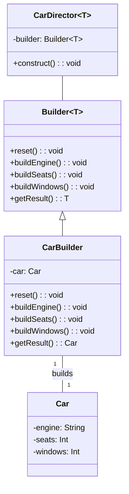

# Builder Design Pattern in Kotlin

The Builder design pattern is a creational design pattern that lets you construct complex objects step by step. It allows you to produce different types and representations of an object using the same construction code.  

## Implementation

In our implementation, we have a Car class that represents a complex object that we want to build. The Car class has properties for engine, seats, and windows.

## Class Diagram

Here is a class diagram for the Builder design pattern:

In this diagram, Builder is a generic interface with methods for building parts of a product and getting the result. CarBuilder is a concrete builder that implements the Builder interface and builds a Car. CarDirector is a class that directs the construction process. It has a reference to a Builder and a method for constructing a product. Car is the product class with properties for engine, seats, and windows.
