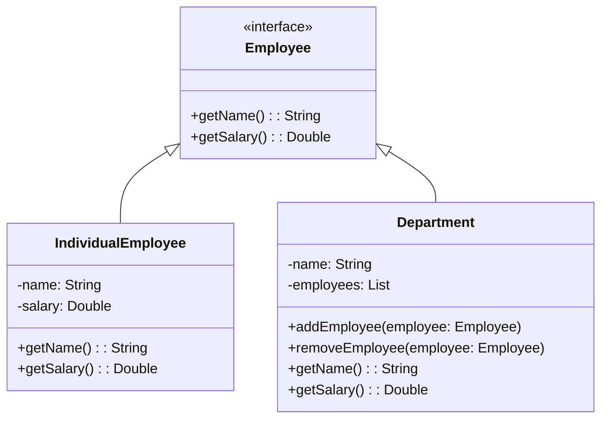
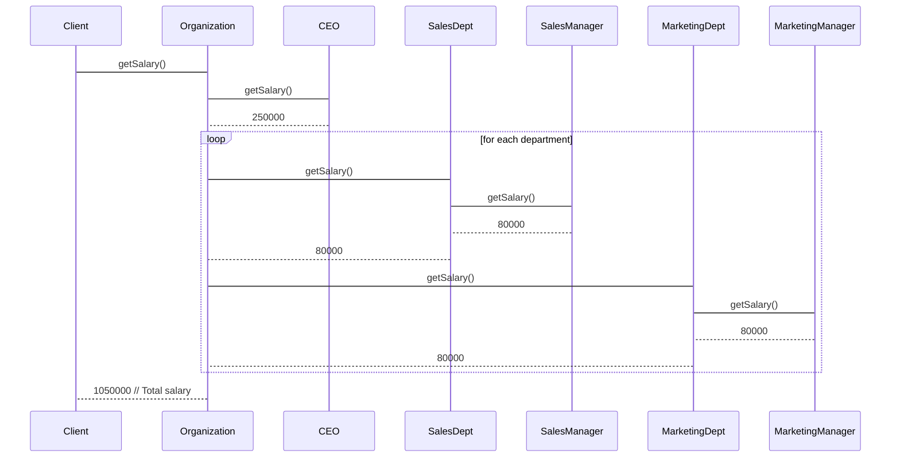

# Composite Design Pattern

## Intent

The Composite design pattern is a powerful structural pattern used in object-oriented programming to create hierarchical structures. It allows you to build complex objects (composites) from simpler ones (components), treating them uniformly in client code. This pattern is particularly useful when dealing with tree-structured data or any situation where similar objects need to be managed in a group. By using the Composite pattern, we can simplify the code, make it more flexible and maintainable, and achieve a uniform interface for handling parts and whole hierarchies.

### Pros of Composite Design Pattern:

* `Simplified Client Code`: The pattern allows clients to treat components and composites uniformly, making the client code less complex and easier to understand.
* `Flexibility in Structure`: Composites can be nested to any level, providing flexibility in building hierarchical structures.
* `Decoupling`: The pattern decouples the client code from the specific implementation of the objects, promoting maintainability.
* `Uniform Interface`: A uniform interface for components and composites reduces the burden of special treatment for different types of objects.

### Cons of Composite Design Pattern:

* `Additional Complexity`: Introducing the Composite pattern can add more complexity, especially when dealing with complex hierarchies.
* `Overhead`: In some cases, the added layer of abstraction can result in additional method calls and performance overhead.
* `Memory Management`: Managing the memory allocation and deallocation for composite objects can be more challenging.

## Class Diagram

The following class diagram shows the structure of the Composite design pattern:

### In this Diagram:

The class diagram represents the structure of objects involved in the Composite pattern example. It consists of three main classes:

* `Employee`: The abstract base class representing any kind of employee, defining the common interface (behaviors) like 'getName()' and 'getSalary()'.
* `IndividualEmployee`: A concrete class representing individual employees, inheriting from 'Employee'.
* `Department`:  A composite class that can contain other employees (both individual and departments), also inheriting from 'Employee'. The 'Department' class has a list of employees, highlighting the "has-a" relationship.

## Sequence Diagram

The following sequence diagram illustrates the interaction between a client and an organization using the Composite pattern to calculate the total salary of all employees:

### In this Diagram:

The sequence diagram illustrates a scenario where the total salary of an 'Organization' is calculated. It involves the following steps:

* The `Client` makes a request to the organization to calculate the total salary.
* The `Organization` delegates the task to its CEO to get its salary.
* The `CEO` then calculates and returns its salary.
* The `Organization` then iterates through each department (composite) to calculate their salaries.
* Each department asks its respective manager for their salary.
* The manager calculates and returns the salary of the department, which is the sum of salaries of its individual employees.
* The `Organization` aggregates the salaries from each department and finally returns the total sum to the client.

## Conclusion

The Composite design pattern is a beneficial structural pattern for building complex structures in object-oriented programming. It enables us to treat components and composites interchangeably, making the client code simpler and more robust. However, like with any design pattern, it comes with its own set of pros and cons. While it simplifies management of hierarchical data, it can add complexity and overhead.

By using the provided class and sequence diagrams, developers can efficiently implement and visualize the Composite pattern, ensuring its proper usage in their software applications.