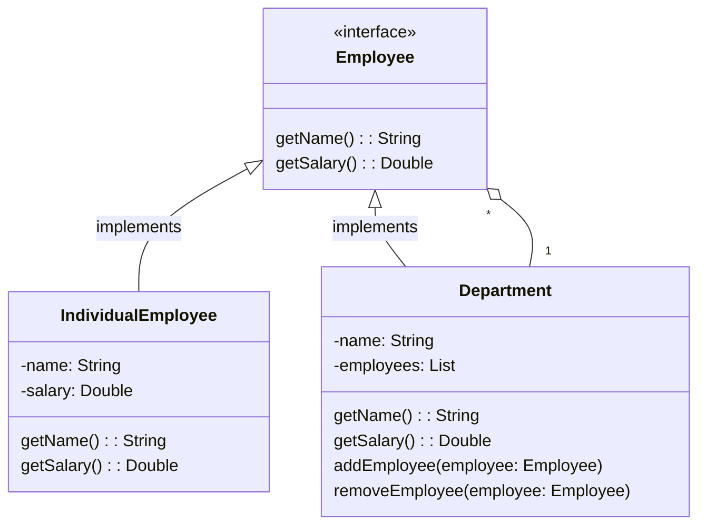
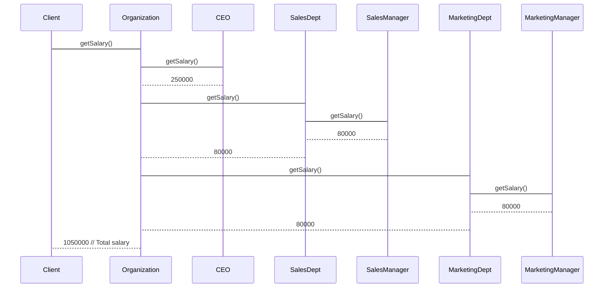

```mermaid
classDiagram


    class Employee {
        <<interface>>
        getName(): String
        getSalary(): Double
    }

    class IndividualEmployee {
        -name: String
        -salary: Double
        getName(): String
        getSalary(): Double
    }

    class Department {
        -name: String
        -employees: List<Employee>
        getName(): String
        getSalary(): Double
        addEmployee(employee: Employee)
        removeEmployee(employee: Employee)
    }
    Employee <|-- IndividualEmployee: implements
    Employee <|-- Department: implements
    Department "1" --o "*" Employee
```

```mermaid
sequenceDiagram
    participant Client
    participant Organization

    Client->Organization: getSalary()
    Organization->CEO: getSalary()
    CEO-->Organization: 250000
    Organization->SalesDept: getSalary()
    SalesDept->SalesManager: getSalary()
    SalesManager-->SalesDept: 80000
    SalesDept-->Organization: 80000
    Organization->MarketingDept: getSalary()
    MarketingDept->MarketingManager: getSalary()
    MarketingManager-->MarketingDept: 80000
    MarketingDept-->Organization: 80000
    Organization-->Client: 1050000  // Total salary
```
