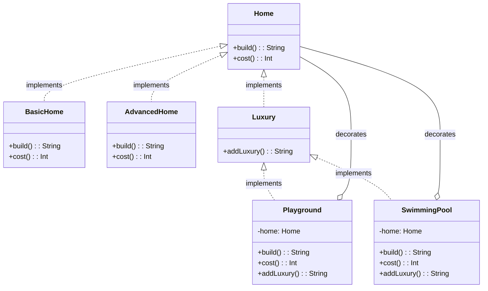
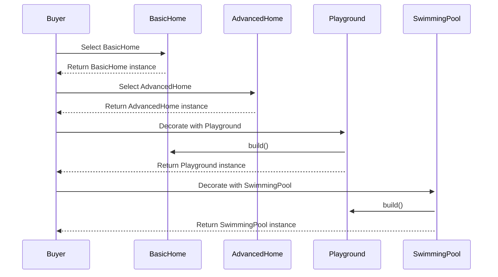

# Decorator Design Pattern: Housing Market Example

### Introduction

The Decorator pattern is a structural design pattern that allows for the dynamic attachment of new behaviors or features to existing objects. It provides a flexible alternative to subclassing when it comes to extending functionality.  In the context of the housing market, the Decorator pattern elegantly models the process of a buyer selecting a base house model and then customizing it with various upgrades or amenities.

### Class Diagram

Let's first examine the class diagram representing the core relationships within this implementation:

### Class Diagram

### Explanation:

- Home: The foundational interface, defining core house actions (build(), cost()).
- BasicHome and AdvancedHome: Concrete house types offering different base options.
- Luxury:  Base interface for potential upgrades.
- Playground and SwimmingPool:  Specific decorators enhancing a house.
- Decorators hold a reference ('home') to the object they decorate.

---

### Sequence Diagram

### Explanation:

- Base Selection: The buyer selects either a BasicHome or AdvancedHome.
- Customization: The buyer can then dynamically decorate the base house with Playground and/or SwimmingPool objects.
- Delegation:  Calls to build() on the top-level decorator propagate through the chain, enabling each decorator to contribute to the final description.

