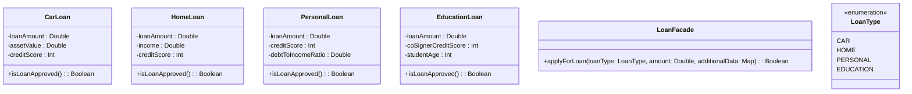
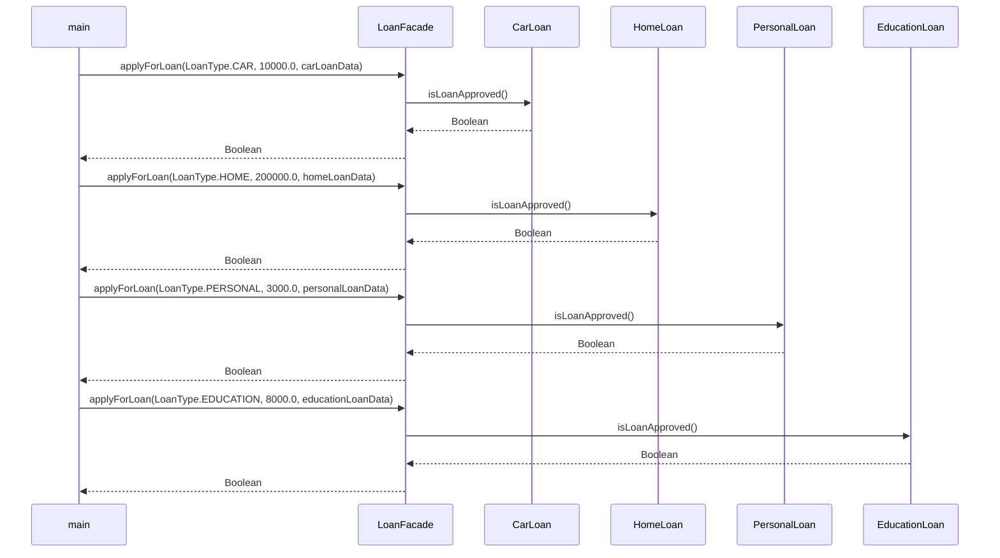

```mermaid
classDiagram
    class CarLoan {
        -loanAmount : Double
        -assetValue : Double
        -creditScore : Int
        +isLoanApproved(): Boolean
    }
    class HomeLoan {
        -loanAmount : Double
        -income : Double
        -creditScore : Int
        +isLoanApproved(): Boolean
    }
    class PersonalLoan {
        -loanAmount : Double
        -creditScore : Int
        -debtToIncomeRatio : Double
        +isLoanApproved(): Boolean
    }
    class EducationLoan {
        -loanAmount : Double
        -coSignerCreditScore : Int
        -studentAge : Int
        +isLoanApproved(): Boolean
    }
    class LoanFacade {
        +applyForLoan(loanType: LoanType, amount: Double, additionalData: Map<String, Any>): Boolean
    }
    class LoanType {
        <<enumeration>>
        CAR
        HOME
        PERSONAL
        EDUCATION
    }
```

```mermaid
sequenceDiagram
    participant main as main
    participant facade as LoanFacade
    participant carLoan as CarLoan
    participant homeLoan as HomeLoan
    participant personalLoan as PersonalLoan
    participant educationLoan as EducationLoan

    main->>facade: applyForLoan(LoanType.CAR, 10000.0, carLoanData)
    facade->>carLoan: isLoanApproved()
    carLoan-->>facade: Boolean
    facade-->>main: Boolean

    main->>facade: applyForLoan(LoanType.HOME, 200000.0, homeLoanData)
    facade->>homeLoan: isLoanApproved()
    homeLoan-->>facade: Boolean
    facade-->>main: Boolean

    main->>facade: applyForLoan(LoanType.PERSONAL, 3000.0, personalLoanData)
    facade->>personalLoan: isLoanApproved()
    personalLoan-->>facade: Boolean
    facade-->>main: Boolean

    main->>facade: applyForLoan(LoanType.EDUCATION, 8000.0, educationLoanData)
    facade->>educationLoan: isLoanApproved()
    educationLoan-->>facade: Boolean
    facade-->>main: Boolean
```