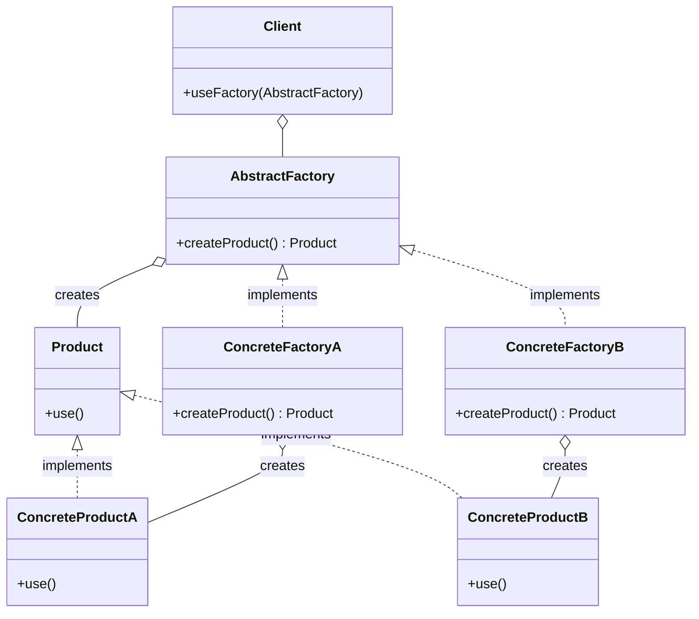

# Factory Design Pattern

The factory design pattern defines an interface for creating an object, 
but lets subclasses decide which class to instantiate. The Factory Method 
pattern lets a class defer instantiation to subclasses.

In Kotlin, a generic factory design pattern can be implemented using the 
following components:

1. AbstractFactory Interface: This interface defines the base methods 
that all concrete factories must implement. It allows the client code 
to create products without knowing the concrete factory class.

2. ConcreteFactory Classes: These are the specific implementations of 
the factory that create products of a particular type.

3. Product Interface: This interface defines the common behavior of 
all products created by the factory.

4. ConcreteProduct Classes: These are the specific implementations 
of the products that are created by the factory.

Here's a complete implementation of the generic factory design pattern in Kotlin:

