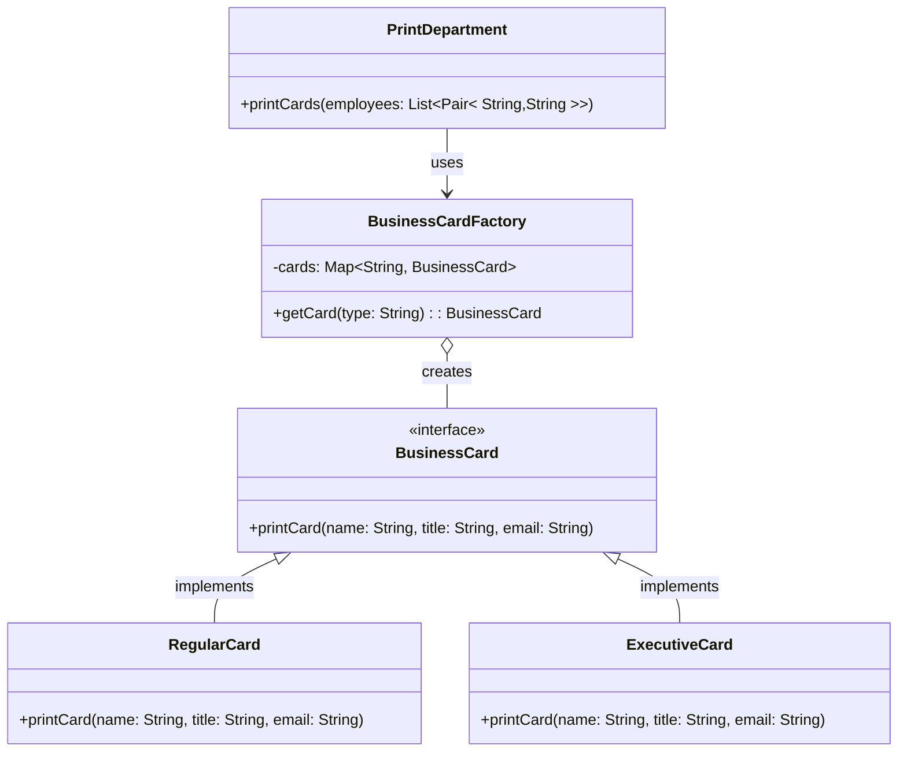
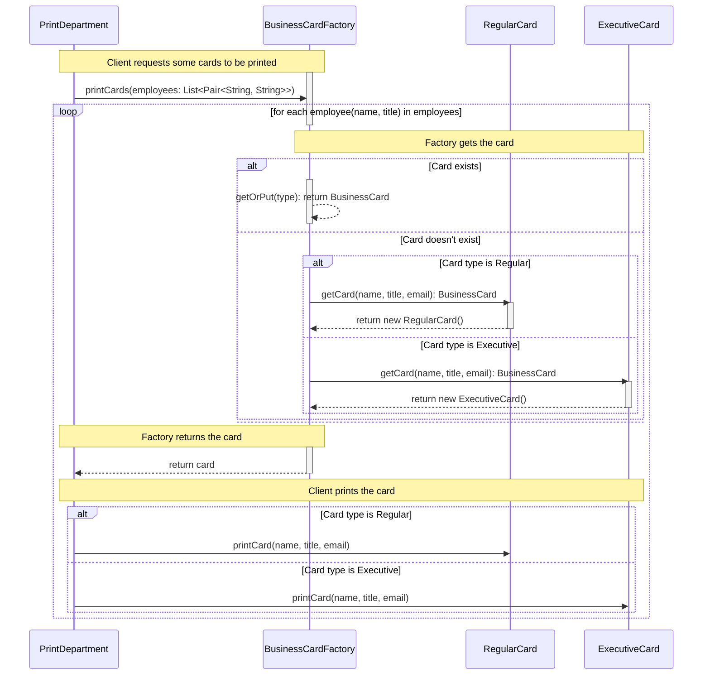

# Flyweights

## Intent

Flyweight is a structural design pattern. A flyweight is a shared object that 
can be used in multiple contexts simultaneously. The flyweight acts as an 
independent object in each context—it’s indistinguishable from an instance of 
the object that’s not shared. Flyweights cannot make assumptions about the context 
in which they operate. The key concept here is the distinction between intrinsic 
and extrinsic states. The intrinsic state is stored in the flyweight; it consists 
of information that’s independent of the flyweight’s context, thereby making it 
sharable. The extrinsic state depends on and varies with the flyweight’s context 
and therefore can’t be shared. Client objects are responsible for passing extrinsic 
state to the flyweight when it needs it.

## Real-Life Example

Suppose you have a pen. You can use different ink refills to write with different colors. So, 
the pen without the refill can be considered the flyweight with intrinsic data, and the refills 
can be considered the extrinsic data in this example. Now consider the case when you have many 
similar pens with different ink fills. For simplicity, assume that you have some pens with red 
refills and some pens with green refills and you want to distribute these pens among the kids. 
Later you identify that the kids like red pens more than green pens. So, you replace the green 
refills with red refills to make more red pens and distribute them among the kids to make them happy.

Consider another example. Suppose a company needs to print business cards for its employees. In 
this case, what is the starting point? The print department can create a common template where 
the company logo, address, and other details are already printed (intrinsic) and later the 
company adds the particular employee details (extrinsic) on the cards.

## Structure

The Flyweight pattern consists of the following parts:

1. **Flyweight Interface**: This is the interface that the flyweight objects must implement. 
   This interface allows the flyweights to receive and act on extrinsic state.
2. **Concrete Flyweight**: This is the actual flyweight object that implements the Flyweight 
   interface. This object is shared among multiple contexts.
3. **Flyweight Factory**: This is a factory class that creates and manages the flyweight objects. 
   It ensures that the flyweights are shared and reused.
4. **Client**: This is the class that uses the flyweight objects. The client is responsible for 
   passing extrinsic state to the flyweights when they need it.
5. **Context**: This is the state that the flyweights need to perform their operations. This state 
   is passed to the flyweights by the client.
6. **Client Factory**: This is a factory class that creates and manages the client objects. It 
   ensures that the client objects are created and used correctly.
7. **Client Object**: This is the class that uses the flyweight objects. The client is responsible 
   for passing extrinsic state to the flyweights when they need it.

## Class Diagram

**Note: The client factor has been removed for simplicity**

### Class Diagram

The class diagram shows the relationship between different classes in the code.  

* `BusinessCard`: This is an interface that defines a method printCard(). This method is used to print the details of an employee on a business card.  
* `RegularCard and ExecutiveCard`: These are concrete classes that implement the BusinessCard interface. They override the printCard() method to print the details of an employee on a regular or executive business card, respectively.  
* `BusinessCardFactory`: This is a factory class that creates and manages BusinessCard objects. It uses a map to store and reuse BusinessCard objects. The getCard() method is used to get a BusinessCard object of a specific type.  
* `PrintDepartment`: This is a client class that uses BusinessCard objects. It has a method printCards() that prints business cards for a list of employees.

## Sequence Diagram

### Sequence Diagram

The sequence diagram shows the sequence of interactions between different objects over time.  

* `PrintDepartment (Client)`: This object represents the client that requests some cards to be printed.  
* `BusinessCardFactory (Factory)`: This object represents the factory that creates and manages BusinessCard objects.  
* `RegularCard and ExecutiveCard (Flyweight)`: These objects represent the flyweight objects that are shared and reused.  

The sequence diagram shows the following sequence of interactions:  

* `PrintDepartment` requests `BusinessCardFactory` to print some cards.
* For each employee in the list of employees, `BusinessCardFactory` gets a `BusinessCard` object of a specific type. If the `BusinessCard` object of the required type exists, it is returned. Otherwise, a new `BusinessCard` object is created.
* `BusinessCardFactory` returns the `BusinessCard` object to `PrintDepartment`.
* `PrintDepartment` prints the card by calling the `printCard()` method on the `BusinessCard` object.  

The loop in the sequence diagram represents the process of printing cards for each employee in the list of employees. The alt blocks in the sequence diagram represent alternative paths based on conditions.
