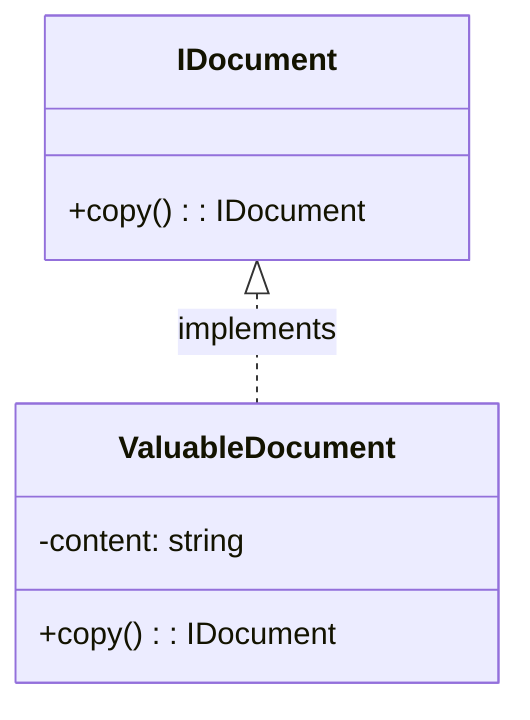
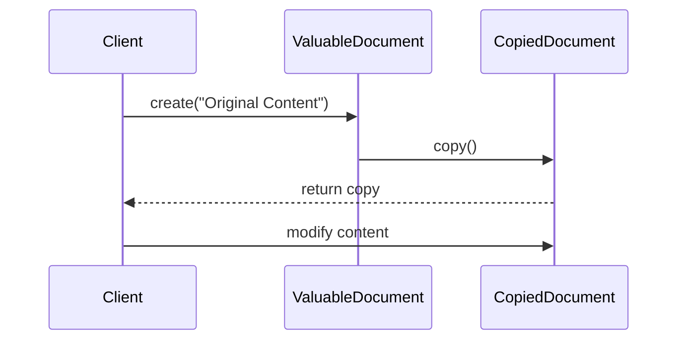

# Prototype Design Pattern

## Introduction

The Prototype Design Pattern is a creational design pattern in 
software development. It is used when the type of objects to 
create is determined by a prototypical instance, which is cloned 
to produce new objects. This pattern is used to avoid subclasses 
of an object creator in the client application, like the 
abstract factory pattern does.  

## Problem Statement

In this project, the Prototype Design Pattern is implemented in 
the `IDocument` interface and the `ValuableDocument` class. The 
`IDocument` interface declares a copy method, which is used to 
create and return a copy of the current object. The 
`ValuableDocument` class, which implements the `IDocument` 
interface, overrides the copy method to return a new `ValuableDocument` 
with the same content as the current one. 

## UML Diagram

The UML diagram above represents the Prototype Design Pattern:

1. `class IDocument`: This is an interface that declares a `copy()` method. 
The `copy()` method is expected to return an instance of IDocument. This interface 
represents the prototype that will be cloned.  
2. `class ValuableDocument`: This is a class that implements the `IDocument` interface. 
It has a private field content of type string and overrides the `copy()` method to 
return a new ValuableDocument with the same content as the current one. This class 
represents the concrete prototype that will be cloned.  
3. `IDocument <|.. ValuableDocument : implements`: This represents that the `ValuableDocument` 
class implements the `IDocument` interface. The arrow with a hollow triangle head pointing 
towards `IDocument` signifies that `ValuableDocument` is a subtype of `IDocument`.

## Sequence Diagram

The sequence diagram in your project represents the flow of operations in the 
`Prototype Design Pattern`. Here's the explanation in actual terms: 

1. `Client ->> ValuableDocument: create("Original Content")`: This represents the `Client` 
creating a new instance of the `ValuableDocument` class with the content "Original Content". 
This is the original document that will be cloned.  
2. `ValuableDocument ->> CopiedDocument: copy()`: This represents the `copy()` method 
being called on the `ValuableDocument` instance. This method creates a new instance of 
`ValuableDocument` (referred to as `CopiedDocument` in the diagram) with the same content 
as the original document.  
3. `CopiedDocument -->> Client: return copy`: This represents the `copy()` method returning 
the `CopiedDocument` instance to the Client. The `Client` now has a clone of the original 
document.  
4. `Client ->> CopiedDocument: modify content`: This represents the Client modifying 
the content of the `CopiedDocument`. This demonstrates that the `CopiedDocument` is a 
separate instance from the original `ValuableDocument`, as changes to the `CopiedDocument` 
do not affect the original `ValuableDocument`.  

This sequence diagram is a visual representation of the Prototype Design Pattern, 
showing how an original object can be cloned to create a new object, and how changes 
to the new object do not affect the original object.