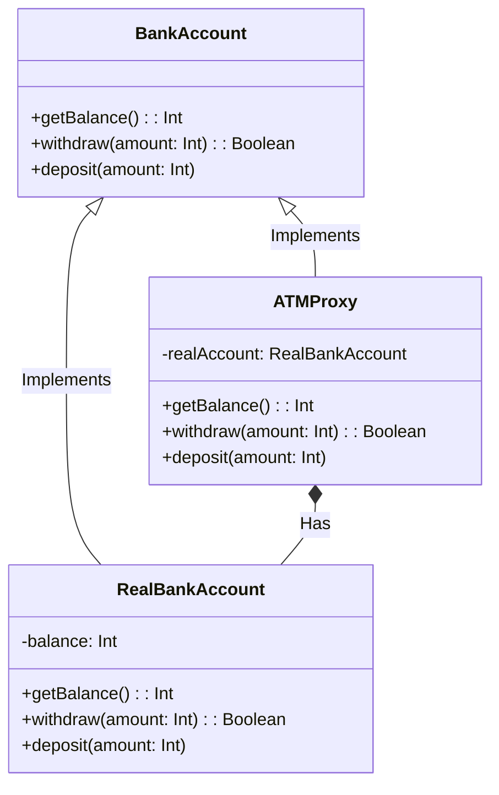
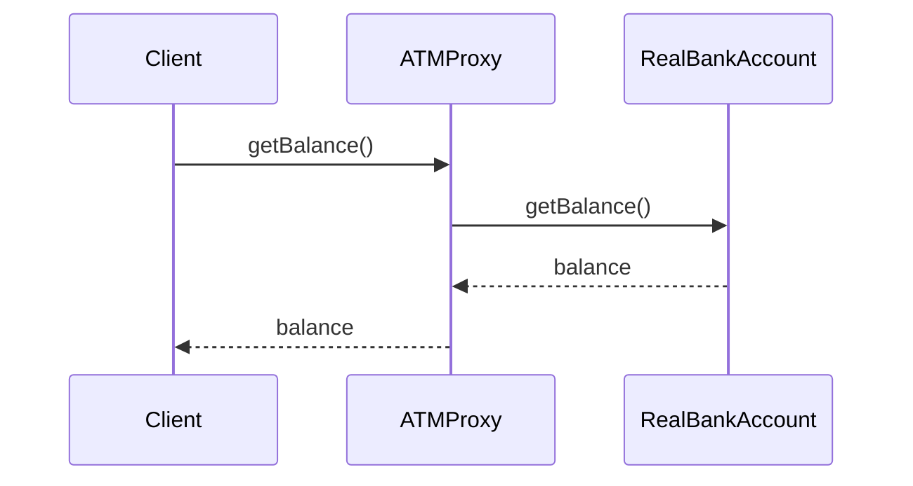

# Proxy Design Pattern

The proxy pattern offers a way to control access to an object by providing a stand-in or surrogate object that wraps the original object.

---

### **Key Purposes**

- **Access Control**: Limit access to the real object based on certain conditions, such as security or permissions.
- **Lazy Loading**: Delay the creation of expensive objects until they are actually needed.
- **Remote Access**: Facilitate interaction with objects located in remote systems.
- **Logging and Monitoring**: Add additional functionality (e.g., logging) without altering the original object.

### **Class Diagram**



### **Explanation**:

- **BankAccount**: The common interface for both the real object and its proxy.
- **RealBankAccount**: The actual object with core business logic.
- **ATMProxy**: The proxy class. Controls access to the real bank account and might add extra functionality.

---

### **Sequence Diagram**



### **Explanation**:

- The `Client` requests the balance from the `ATMProxy`.
- The `ATMProxy` forwards the request to the `RealBankAccount`.
- The `RealBankAccount` retrieves the balance and returns it to the `ATMProxy`.
- The `ATMProxy` returns the balance to the `Client`.

---

### **Kotlin Example** 

```kotlin
interface BankAccount {
    fun getBalance(): Int
    fun withdraw(amount: Int): Boolean
    fun deposit(amount: Int)
}

class RealBankAccount : BankAccount {
    private var balance = 5000 // Initial balance
    override fun getBalance(): Int {
        return balance
    }
    override fun withdraw(amount: Int): Boolean {
        if (amount <= balance) {
            balance -= amount
            return true
        }
        return false
    }
    override fun deposit(amount: Int) {
        balance += amount
    }
}

class ATMProxy : BankAccount {
    private val realAccount = RealBankAccount()
    override fun getBalance(): Int {
        return realAccount.getBalance()
    }
    override fun withdraw(amount: Int): Boolean {
        if (realAccount.getBalance() >= amount) {
            println("Withdrawing $amount")
            return realAccount.withdraw(amount)
        } else {
            println("Insufficient funds.")
            return false
        }
    }
    override fun deposit(amount: Int) {
        println("Depositing $amount")
        realAccount.deposit(amount)
    }
}

fun main() {
    val bankAccount: BankAccount = ATMProxy()
    println("Current balance: ${bankAccount.getBalance()}")
    val withdrawalSuccessful = bankAccount.withdraw(2000)
    if (withdrawalSuccessful) {
        println("Withdrawal successful")
    }
    bankAccount.deposit(1000)
    println("New balance: ${bankAccount.getBalance()}")
}

```

---

### Benefits of the Proxy Pattern in this Example:

- **Security**: The ATMProxy could enforce  withdrawal limits or require authentication.
- **Performance**: Potentially delay the creation of the  RealBankAccount until needed.