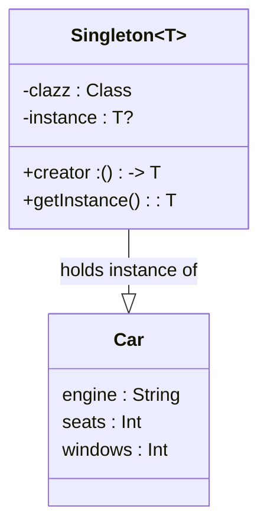

# Singleton Pattern in Kotlin

This project demonstrates the implementation of the Singleton pattern in Kotlin using a generic Singleton class.

## Class Diagram

This diagram represents the `Singleton` class which can 
hold an instance of any type (`T`), in this case, an 
instance of `Car`. The `Car` class has properties 
`engine`, `seats`, and `windows`. The `Singleton` class 
has a `clazz` property of type `Class<T>`, a `creator` 
function that returns an instance of `T`, and an `instance` 
property that holds the singleton instance.